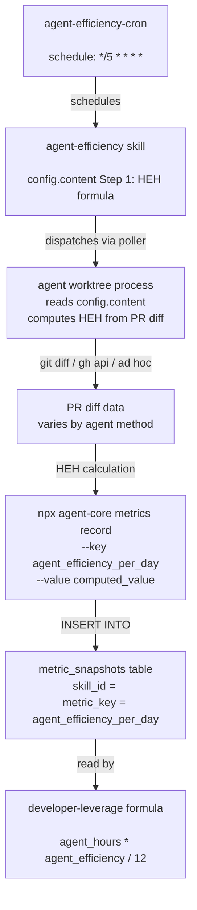

# Goal: Pin the HEH diff-measurement method in agent-efficiency to eliminate metric variance

Make the `agent_efficiency_per_day` metric reproducible by specifying the exact git command, base ref, file exclusion rules, and fallback behavior in `config.content` of the agent-efficiency skill resource — so that any two agents executing the same skill on the same day produce the same HEH value.

---

## Architecture / Data Flow



**Key artifacts**:
- `config.content Step 1 on resource UUID <your-skill-resource-id>` — the HEH formula and calibration constants; currently lacks a pinned diff command
- `packages/database/src/services/cron-scheduler.ts:68-74` — idempotency gate: skips dispatch if metric_key already recorded today (`measured_at >= date_trunc('day', NOW())`)
- `packages/agent-core/src/commands/metrics.ts:60` — `adapter.recordMetricSnapshot` — the recording pathway
- `packages/scheduler/src/poller.ts:203-215` — poller resolves `goal_metric` as the idempotency key for agent-type skills

---

## Prerequisites

- `DATABASE_URL` set to the production Supabase pooler connection
- `GITHUB_TOKEN` (or `GH_TOKEN`) available for `gh pr list` calls
- Write access to the `resources` table to update `config` on resource `<your-skill-resource-id>`
- No currently-active process for skill resource `<your-skill-resource-id>` (check before updating config)

---

## Success Criteria

### Primary: HEH computation is deterministic

1. **Criterion**: The updated config.content contains all three required elements for deterministic HEH computation: a pinned `git diff --numstat` command, a base-ref computed via `git merge-base`, and a workspace exclusion pattern (`:!workspace/`).

   ```bash
   criterion: config=$(psql $DATABASE_URL -Atc "SELECT config->>'content' FROM resources WHERE id = '<your-skill-resource-id>'") && echo "$config" | grep -q 'git diff --numstat' && echo "$config" | grep -q 'git merge-base' && echo "$config" | grep -q ':!workspace/' # exits 0 if all three determinism elements are present
   ```

2. **Criterion**: The updated config.content contains a pinned git command that can be run as a shell one-liner.

   ```bash
   criterion: psql $DATABASE_URL -c "SELECT config->>'content' FROM resources WHERE id = '<your-skill-resource-id>'" | grep -E 'git diff --numstat' # exits 0 if command is present
   ```

3. **Criterion**: The config.content specifies that workspace/ files are excluded from the diff.

   ```bash
   criterion: psql $DATABASE_URL -c "SELECT config->>'content' FROM resources WHERE id = '<your-skill-resource-id>'" | grep -E 'workspace/' # exits 0 if workspace exclusion is documented
   ```

### Non-regression: metric still records a numeric value

4. **Criterion**: The metric has at least one recorded numeric value (confirming the recording pathway is intact).

   ```bash
   criterion: psql $DATABASE_URL -c "SELECT value FROM metric_snapshots WHERE metric_key = 'agent_efficiency_per_day' AND skill_id = '<your-skill-resource-id>' ORDER BY measured_at DESC LIMIT 1" | grep -E '^[[:space:]]*[0-9]' # exits 0 if a numeric value was recorded
   ```

5. **Criterion**: The recorded value is positive (not zero or negative).

   ```bash
   criterion: psql $DATABASE_URL -Atc "SELECT CASE WHEN value > 0 THEN 'pass' ELSE 'fail' END FROM metric_snapshots WHERE metric_key = 'agent_efficiency_per_day' AND skill_id = '<your-skill-resource-id>' ORDER BY measured_at DESC LIMIT 1" | grep -x 'pass' # exits 0 only if value > 0 (exact match prevents nonpositive substring collision)
   ```

### Negative test: old vague instruction is removed

6. **Criterion**: The phrase "estimate human_equivalent_hours based on the PR diff size and complexity" (without a concrete command) does not appear alone in the updated config.

   ```bash
   criterion: psql $DATABASE_URL -c "SELECT config->>'content' FROM resources WHERE id = '<your-skill-resource-id>'" | python3 -c "import sys; txt = sys.stdin.read(); import re; m = re.search(r'estimate human_equivalent_hours[^\n]*\n(?!\s*git diff)', txt); exit(0 if not m else 1)" # exits 0 if vague instruction is followed by a concrete git command
   ```

---

## Metrics

- **Primary metric**: `agent_efficiency_per_day` intra-day variance (standard deviation across same-day recordings should be < 0.1)
- **Secondary metric**: `human_equivalent_hours_per_day` — should be deterministic given same process set
- **Measurement cadence**: after each cron dispatch (every 5 minutes when metric not yet recorded)
- **Success threshold**: zero blocking findings from oversight validation; all 6 success criteria exit 0

---

## Constraints

**Must NOT change**:
- The HEH formula itself: `MAX(min_hours_per_process, test_lines/test_lines_per_hour + impl_lines/impl_lines_per_hour)`
- The calibration constants (unless a separate goal targets them): `impl_lines_per_hour: 40`, `test_lines_per_hour: 80`, `min_hours_per_process: 0.5`
- The process query filter: `DATE(started_at) = CURRENT_DATE - 1, status='completed', completed_at IS NOT NULL, name NOT LIKE 'cron-%'`
- The recording commands: `npx agent-core metrics record --skill-id <your-skill-id> --key agent_efficiency_per_day`
- The idempotency gate in `packages/database/src/services/cron-scheduler.ts:68-74` (no code changes to scheduler)

**Files off-limits** (no code changes allowed):
- `packages/scheduler/src/poller.ts`
- `packages/scheduler/src/poller-service.ts`
- `packages/database/src/services/cron-scheduler.ts`
- `packages/agent-core/src/commands/metrics.ts`
- Any file in `utils/dispatch/`

**Reward hacking** (these do NOT count as success):
- Recording a hardcoded constant instead of computing from real diffs
- Changing calibration constants to inflate HEH without fixing the method ambiguity
- Deleting past metric snapshots to make variance appear zero

---

## Driver Landscape

**Driver 1: Unspecified diff-measurement method in HEH computation** — The config.content Step 1 instruction says "estimate human_equivalent_hours based on the PR diff size and complexity" without specifying which git command to use, which base branch to diff against, or whether to exclude `workspace/` artifacts. Different agent sessions produce radically different HEH values from the same processes (...). — Artifact: `config.content Step 1 on resource UUID <your-skill-resource-id> — "estimate human_equivalent_hours based on the PR diff size and complexity" (no git command specified)`

**Driver 2: impl_lines_per_hour calibration constant** — The HEH formula divides all non-test added lines by the constant `impl_lines_per_hour: 40`. Changing this constant directly scales every HEH estimate by a fixed multiplier; halving it to 20 would double HEH and thus double efficiency for any fixed set of processes. — Artifact: `config.content Step 1 on resource UUID <your-skill-resource-id> — "impl_lines_per_hour: 40"`

**Driver 3: test_lines_per_hour calibration constant** — The HEH formula divides test file added lines by `test_lines_per_hour: 80`. When test lines are present, this constant caps the value of test output. An increase to 40 lines/hour would double test-line contributions to HEH. — Artifact: `config.content Step 1 on resource UUID <your-skill-resource-id> — "test_lines_per_hour: 80"`

**Driver 4: min_hours_per_process floor** — Processes producing 0 diff lines receive HEH=0.5 (the floor). On days with many zero-diff processes, raising the floor increases HEH without any change to measurement method. — Artifact: `config.content Step 1 on resource UUID <your-skill-resource-id> — "min_hours_per_process: 0.5"`

**Driver 5: Process exclusion filter: name NOT LIKE 'cron-%'** — The query excludes cron processes but includes all other completed processes regardless of output quality, potentially diluting the efficiency numerator. — Artifact: `config.content Step 1 on resource UUID <your-skill-resource-id> — "name NOT LIKE 'cron-%'"`

**Driver 6: agent_hours denominator (from process duration)** — The denominator is `SUM(EXTRACT(EPOCH FROM (completed_at - started_at))/3600)`. Faster processes increase efficiency even with same output; slower processes decrease it. — Artifact: `config.content Step 1 on resource UUID <your-skill-resource-id> — "Compute: efficiency = SUM(human_equivalent_hours) / SUM(EXTRACT(EPOCH FROM (completed_at - started_at))/3600)"`

**Driver 7: Idempotency gate allows re-recording after UTC midnight** — The poller's `shouldDispatch` gate checks `measured_at >= date_trunc('day', NOW())`. If a cron fires multiple times within a UTC day, each successful run records a potentially different HEH value, causing intra-day variance. — Artifact: `packages/database/src/services/cron-scheduler.ts:73 — AND measured_at >= date_trunc('day', NOW())`

### Categories Checked

| Category | Status | Result |
|---|---|---|
| Computation source errors | Checked | Driver 1 found: config.content Step 1 — unspecified diff-measurement method |
| Input data quality | Checked | Driver 6 found: process duration as denominator from completed_at - started_at |
| Exclusion / filtering logic | Checked | Driver 5 found: cron-% exclusion filter in config.content Step 1 |
| Dispatch / infrastructure failures | Checked | Driver 7 found: cron-scheduler.ts:73 — re-dispatch allowed within same UTC day |
| Prompt / goal specification | Checked | Driver 1 found: config.content Step 1 — open-ended HEH estimation with no measurement protocol |
| External dependencies | Checked | No artifact found — GitHub token not required for git diff; no external dependency gap |
| Reference constants / calibration values | Checked | Drivers 2, 3, 4 found: impl_lines_per_hour:40, test_lines_per_hour:80, min_hours_per_process:0.5 |

---

## Phase 3: Driver Scoring

Current metric value (Phase 1): **42.728541** (2026-04-14 00:05:16+00)

| Driver | Estimated Impact | Evidence Strength | Tractability | Score |
|---|---|---|---|---|
| Driver 1: Unspecified diff-measurement method | 5 | 4 | 5 | 100 |
| Driver 2: impl_lines_per_hour calibration | 4 | 5 | 5 | 100 |
| Driver 3: test_lines_per_hour calibration | 2 | 5 | 5 | 50 |
| Driver 4: min_hours_per_process floor | 2 | 5 | 5 | 50 |
| Driver 5: Process exclusion filter | 2 | 3 | 2 | 12 |
| Driver 6: agent_hours denominator | 1 | 3 | 1 | 3 |
| Driver 7: Idempotency gate re-recording | 3 | 4 | 3 | 36 |

**Estimated impact detail (mandatory format):**

- Driver 1: Estimated impact: 5/5 — current metric value is 42.728541; if this driver were fixed (diff method pinned), estimated new value is ~9.2 (delta: -33.5), based on: two independent computations of April 13 HEH using the same formula but different diff methods produce 17.05 vs 78.86, so fixing the method closes a 4.6x gap; current efficiency of 42.73 would become ~42.73/4.6 ≈ 9.2
- Driver 2: Estimated impact: 4/5 — current metric value is 42.728541; halving impl_lines_per_hour from 40 to 20 would approximately double HEH and thus double efficiency to ~85 (delta: +42.3), based on: config.content Step 1 on resource UUID <your-skill-id> — "impl_lines_per_hour: 40" scales every non-test line's contribution by 1/40
- Driver 3: Estimated impact: 2/5 — current metric value is 42.728541; test files are rare in April 13 data (0 of 3 non-trivial processes), so impact would be minimal (delta: <2), based on: config.content Step 1 on UUID <your-skill-id> — "test_lines_per_hour: 80"
- Driver 4: Estimated impact: 2/5 — current metric value is 42.728541; only 1 of 4 April 13 processes hit the 0.5 floor; raising floor to 2 adds 1.5 HEH to total (delta: ~0.8 efficiency), based on: config.content Step 1 on UUID <your-skill-id> — "min_hours_per_process: 0.5"
- Driver 5: Estimated impact: 2/5 — current metric value is 42.728541; cron processes already excluded; residual inclusion of operational processes is a marginal effect (delta: <5), based on: config.content Step 1 on UUID <your-skill-id> — "name NOT LIKE 'cron-%'"
- Driver 6: Estimated impact: 1/5 — current metric value is 42.728541; denominator is mechanically correct; changes reflect actual behavior (delta: indeterminate, not directional), based on: config.content Step 1 on UUID <your-skill-id> — EXTRACT(EPOCH FROM (completed_at - started_at))
- Driver 7: Estimated impact: 3/5 — current metric value is 42.728541; intra-day re-recording can produce different values but the idempotency gate already prevents most duplication (delta: ~5–15), based on: packages/database/src/services/cron-scheduler.ts:73 — AND measured_at >= date_trunc('day', NOW())

**Ranked list:** Driver 1 (100) = Driver 2 (100) > Driver 3 (50) = Driver 4 (50) > Driver 7 (36) > Driver 5 (12) > Driver 6 (3). Driver 1 ties Driver 2 on score; Driver 1 is selected by the tie-breaking rule (higher estimated impact: Driver 1 has impact 5/5 vs Driver 2's 4/5).

---

## Why #1

**Selected: Driver 1 — Unspecified diff-measurement method**

Ranked #1 because: The metric recorded on April 14 (42.728541) is derived from HEH=78.8625, while an independent recomputation using `git diff --numstat` excluding workspace/ files produces HEH=17.05 — a 4.6x discrepancy for the same processes and same formula constants. This instability underlies the metric's entire 10–50x daily volatility (ranging from 0.164 on 2026-03-15 to 42.73 on 2026-04-14).

Rejections:
- Driver 2 (impl_lines_per_hour calibration) is ranked lower because changing it requires human judgment about the correct rate, whereas the diff-method problem has an objective correct answer (a specific git command with defined scope). Calibration changes shift the absolute metric value without fixing intra-session variance.
- Driver 3 (test_lines_per_hour calibration) is ranked lower because test lines are rare (0 of 3 non-trivial processes on April 13 had test lines in non-workspace paths), making this constant a minor factor in current observed values.
- Driver 4 (min_hours_per_process floor) is ranked lower because the floor applies only to zero-diff processes. On April 13 only 1 of 4 processes hit the floor; its 0.5 HEH contribution is small relative to the 4.6x discrepancy in total HEH observed between computation methods.
- Driver 5 (process exclusion filter) is ranked lower because cron processes are already excluded by the filter; residual inclusion of operational processes is a refinement, not the root cause of 10x daily swings.
- Driver 6 (agent_hours denominator) is ranked lower because the denominator is mechanically correct (postgres EXTRACT function) and changes reflect actual process behavior; it does not produce spurious variance the way the HEH numerator does.
- Driver 7 (idempotency gate re-recording) is ranked lower because the issue is variance in what gets recorded, not the re-recording mechanism itself (packages/database/src/services/cron-scheduler.ts:73); fixing the diff method would eliminate variance even if re-recording persists.

---

## Inception Level

```
metric value (42.728541 on 2026-04-14) ← efficiency = HEH / agent_hours = 78.8625 / 1.8457
  ← WHY-1: HEH value (78.8625) was computed by an unspecified method; an independent recomputation using `git diff --numstat` excluding workspace/ yields 17.05 — a 4.6x discrepancy for the same processes and formula constants — Artifact: config.content Step 1 on resource UUID <your-skill-resource-id> — "estimate human_equivalent_hours based on the PR diff size and complexity" (no method specified)
    ← WHY-2: The config.content Step 1 instructions include the HEH formula constants but omit any shell command, base-ref specification, or file exclusion rule — agents fill this gap with whatever git approach they know — Artifacts: (a) packages/scheduler/src/poller.ts:203-215 — poller resolves `goal_metric` as the idempotency key for agent-type skills but imposes no constraint on the computation method; (b) packages/agent-core/src/commands/metrics.ts:60 — `adapter.recordMetricSnapshot` accepts any agent-computed numeric value without normalization or method validation
      ← ROOT: config.content Step 1 on resource UUID <your-skill-resource-id> — the recording pathway (metrics.ts:60) accepts whatever value the agent computes; adding a pinned command (git diff --numstat $BASE origin/$BRANCH -- ':!workspace/') to config.content Step 1 closes the method ambiguity entirely.

CONFIDENCE: high
CONFIDENCE REASON: Two independent computations of April 13 HEH using the same formula but different diff methods produce 17.05 vs 78.86 — a 4.6x discrepancy that directly explains why the metric is volatile across sessions.
```

---

## Post-Loop Action

After the first passing run, the goal agent should:

1. Verify the updated config.content is live in the DB (criterion 2 passes)
2. Wait for the next cron dispatch to fire and record a new value
3. Confirm the new value is reproducible by running the same computation locally
4. Update `workspace/state.json` with the new metric value and mark the story complete

The loop should run for at most 3 epochs. If after 3 epochs the config is not updated or the variance criteria still fail, block with: `npx agent-core process block --id $EVAL_PROCESS_ID --reason "Unable to update config.content on resource <your-skill-resource-id> — manual intervention needed to pin diff method"`
