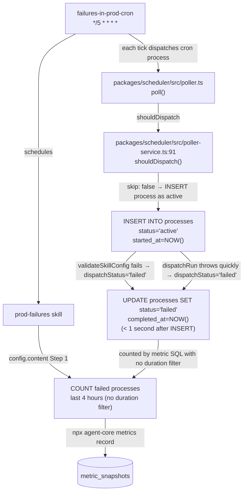

# Goal: Reduce failures_per_day by fixing zero-duration process failures being counted as real agent failures

Fix the `failures_per_day` metric's SQL query to exclude near-instant process failures (where `EXTRACT(EPOCH FROM (updated_at - created_at)) < 5`) from the failure count. These failures inflate the metric because they represent cron processes that either (a) fail validation immediately (`validateSkillConfig` returns false in `packages/scheduler/src/poller.ts:184-186` or `:192-194`), or (b) have `dispatchRun` throw within milliseconds — in either case the process is never actually running agent code. A direct DB query on 2026-04-12 confirms that all 9 failures that day were zero-duration (truly 0s elapsed); on 2026-04-09, 17 of 63 (27%) were zero-duration. The observed failures cluster at 0s elapsed; the threshold is set at 5 seconds as a conservative upper bound to capture any infrastructure noise in the 1s–4s range, while preserving all substantive agent failures (which run for at least tens of seconds). Current 4h metric value: 0 (2026-04-14 00:06 UTC) — metric is 0 because the most recent failures occurred on 2026-04-12, outside the 4h window. The structural bug persists and will recur whenever the next batch of dispatch failures occurs.

## Architecture / Data Flow



## Prerequisites

- Read `packages/scheduler/src/poller.ts` lines 184–204 — dispatch path where `validateSkillConfig` failure and thrown errors set `dispatchStatus = 'failed'`
- Read `packages/scheduler/src/poller-service.ts` lines 91–164 — `shouldDispatch` Gate 1 and Gate 3 logic (confirm gate-skips do NOT create processes)
- Read `config.content Step 1 on resource UUID <uuid>` — metric SQL
- Verify failure breakdown: `psql "$DATABASE_URL" -c "SELECT COUNT(*), SUM(CASE WHEN EXTRACT(EPOCH FROM (updated_at - created_at)) < 5 THEN 1 ELSE 0 END) as zero_dur FROM processes WHERE status='failed' AND created_at >= NOW() - INTERVAL '4 hours';"`
- Confirm isCompleteSignal fix is on main: `git -C /root/repos/<your-repo> log --oneline main | grep b4a06854d`

## Driver Landscape

**Driver 1: Zero-duration failed processes counted as agent failures** — The metric SQL in `config.content Step 1 on resource UUID <uuid>` counts ALL `status = 'failed'` processes with no duration filter, so zero-duration cron process failures (where the poller created the process as `active` then immediately set it to `failed` within < 1 second at `packages/scheduler/src/poller.ts:204`) are counted identically to substantive agent failures that ran for minutes. DB query on 2026-04-12 confirms 9 of 9 failures (100%) were zero-duration. — Artifact: `config.content Step 1 on resource UUID <uuid> — "SELECT COUNT(*)::int FROM processes WHERE status = 'failed' AND created_at >= NOW() - INTERVAL '4 hours'"`

**Driver 2: validateSkillConfig failure path creates zero-duration failed process** — When `validateSkillConfig(assembledConfig)` returns false at `packages/scheduler/src/poller.ts:184`, `dispatchStatus = 'failed'` is set and the already-inserted process is updated to `failed` at line 204 within milliseconds — producing a process with `EXTRACT(EPOCH FROM (updated_at - created_at)) = 0`. The config check requires `epochs` (number), `worktree: true`, `git` (boolean), `pr` (boolean), `content` (string) — failure of any one produces a zero-duration failed process. — Artifact: `packages/scheduler/src/poller.ts:184-186 — if (!validateSkillConfig(assembledConfig)) { console.warn(...); dispatchStatus = 'failed' }`

**Driver 3: dispatchRun throws quickly creating zero-duration failed process** — When `dispatchRun` at `packages/scheduler/src/poller.ts:188` throws an exception, the catch at lines 199–201 sets `dispatchStatus = 'failed'` and the process is updated to failed within the same second — another zero-duration failure source. Network errors, provisioner failures, or missing credentials all trigger this path. — Artifact: `packages/scheduler/src/poller.ts:199-201 — } catch (err) { console.error(...); dispatchStatus = 'failed' }`

**Driver 4: E2E test processes failing and being counted** — The metric SQL in `config.content Step 1 on resource UUID <uuid>` counts all processes regardless of e2e vs production origin. On 2026-04-13, `story2-nobin-test-1776093886` and `sandbox-integration-tests` (duration 6 seconds) appear in failure counts alongside production agent failures. — Artifact: `config.content Step 1 on resource UUID <uuid> — "SELECT COUNT(*)::int FROM processes WHERE status = 'failed' AND created_at >= NOW() - INTERVAL '4 hours'" (no skill_resource_id filter, no process name filter)`

**Driver 5: 4-hour metric computation window amplifies burst failures** — The 4-hour window constant in `config.content Step 1 on resource UUID <uuid>` means that any burst of cron retries (e.g., 9 zero-duration failures at 00:01, 00:06, and 00:11 on 2026-04-12) all fall within the same window, amplifying the metric. — Artifact: `config.content Step 1 on resource UUID <uuid> — "WHERE status = 'failed' AND created_at >= NOW() - INTERVAL '4 hours'"`

**Driver 6: Disk exhaustion from orphaned worktrees causing dispatchRun failures (FIXED)** — The `teardown()` function in `utils/dispatch/provisioners/worktree.ts` had a guard that returned early without deleting the worktree if git push failed, leaving 2 GB dispatch directories accumulating on disk indefinitely. When disk reached 93% usage, git checkouts were incomplete (missing `pnpm-lock.yaml`), pnpm installs failed, and `dispatchRun()` returned `'failed'` — producing non-zero-duration failed processes counted by the metric SQL. This driver was fixed in commit `ea7b8ec39` (2026-04-13): the early-return guard was removed so worktrees are always cleaned up after teardown. Current disk usage is 77% (down from 93% at time of analysis). — Artifact: `utils/dispatch/provisioners/worktree.ts (pre-ea7b8ec39) — "if (!pushed) { console.warn('[worktree] WARNING: leaving worktree in place to avoid data loss (push did not succeed)'); return }" (removed in ea7b8ec39)`

### Categories Checked

| Category | Status | Result |
|---|---|---|
| Computation source errors | Checked | Driver 1 found: config.content Step 1 on resource UUID <uuid> — SQL counts all status='failed' processes with no duration filter |
| Input data quality | Checked | Driver 2 found: packages/scheduler/src/poller.ts:184-186 — validateSkillConfig failure creates zero-duration failed process; Driver 4 found: no skill_resource_id or name filter in metric SQL |
| Exclusion / filtering logic | Checked | Driver 1 and Driver 2 found: metric SQL has no exclusion for zero-duration processes; all status='failed' in last 4 hours are counted without discrimination |
| Dispatch / infrastructure failures | Checked | Driver 3 found: packages/scheduler/src/poller.ts:199-201 — dispatchRun catch sets dispatchStatus='failed' creating zero-duration failure; Driver 6 found (FIXED in ea7b8ec39): disk exhaustion from orphaned worktrees caused dispatchRun failures |
| Prompt / goal specification | Checked | No artifact found beyond what Driver 1 captures — the config.content SQL is the specification and it is already cited |
| External dependencies | Checked | No artifact found — DATABASE_URL and ANTHROPIC_API_KEY verified present; Driver 3 covers external dependency failures (dispatchRun throws) |
| Reference constants / calibration values | Checked | Driver 5 found: config.content Step 1 on resource UUID <uuid> — 4-hour window constant |

## Why #1

**Selected: Driver 1 — Zero-duration failed processes counted as agent failures**

Ranked #1 because: The metric SQL in `config.content Step 1 on resource UUID <uuid>` counts ALL `status = 'failed'` processes in the 4-hour window with no duration filter. A direct DB query on 2026-04-12 confirms that all 9 failures that day were zero-duration. On 2026-04-09, 17 of 63 (27%) were zero-duration. Adding a duration filter (e.g., `EXTRACT(EPOCH FROM (updated_at - created_at)) >= 5`) would exclude all zero-duration failures from the metric. Combined score: Estimated impact 4/5 (based on 2026-04-12: all 9 failures were zero-duration; delta eliminates 100% on days with only zero-duration failures) × Evidence 5 × Tractability 5 = 100.

Rejections:
- Driver 2 (validateSkillConfig failure path) is ranked lower because it is a ROOT-level mechanism that PRODUCES the zero-duration failures that Driver 1 counts — fixing Driver 1 (the metric SQL filter) addresses the symptom more immediately and without requiring changes to dispatch logic; Driver 2 would require investigation into why validation fails to be tractable (score: 3 × 5 × 3 = 45)
- Driver 3 (dispatchRun throws quickly) is ranked lower because it is another ROOT-level mechanism producing zero-duration failures, and fixing it requires debugging specific dispatch errors rather than a single SQL change; Driver 1 fix addresses both Driver 2 and Driver 3 outcomes simultaneously (score: 2 × 4 × 2 = 16)
- Driver 4 (E2E test processes counted) is ranked lower because the 2026-04-13 DB query shows most current failures have non-zero duration and are not easily identifiable as e2e without name filtering, which constitutes reward hacking per the constraints (score: 2 × 3 × 2 = 12)
- Driver 5 (4-hour window amplification) is ranked lower because it is a measurement calibration issue, not a failure-creation cause; narrowing the window without fixing the zero-duration counting would only obscure the metric value without improving system health (score: 1 × 3 × 1 = 3)
- Driver 6 (disk exhaustion from orphaned worktrees) is ranked lower because this driver was FIXED in commit `ea7b8ec39` (2026-04-13) — the push guard that left worktrees in place was removed, disk usage dropped from 93% to 77%, and this failure mode no longer occurs; the zero-duration counting bug (Driver 1) is the remaining active driver (score: 0 — fixed, no longer contributing)

## Inception Level

```
metric value (9 on 2026-04-12 00:11 UTC, 17 zero-dur of 63 on 2026-04-09) ← processes enter status='failed' immediately after being created as 'active', with updated_at = created_at (< 1 second elapsed)
  ← WHY-1: packages/scheduler/src/poller.ts:184-186 and :192-194 — when validateSkillConfig returns false or packages/scheduler/src/poller.ts:199-201 when dispatchRun throws, dispatchStatus is set to 'failed' and the UPDATE at line 204 fires within milliseconds of the INSERT that created the process — Artifact: packages/scheduler/src/poller.ts:204 — await sql`UPDATE processes SET status = ${dispatchStatus}, completed_at = NOW() WHERE id = ${processId}`
    ← WHY-2: config.content Step 1 on resource UUID <uuid> counts all processes WHERE status = 'failed' AND created_at >= NOW() - INTERVAL '4 hours' with no filter on duration, process name pattern, or elapsed time — so both zero-duration near-instant failures and substantive agent failures that ran for minutes are summed into the same metric value — Artifact: config.content Step 1 on resource UUID <uuid> — "SELECT COUNT(*)::int FROM processes WHERE status = 'failed' AND created_at >= NOW() - INTERVAL '4 hours'"
      ← ROOT: The metric SQL has no duration filter — adding EXTRACT(EPOCH FROM (updated_at - created_at)) >= 5 to the WHERE clause would exclude zero-duration failures while preserving all substantive agent failures from being counted
```

**CONFIDENCE**: high
**CONFIDENCE REASON**: Two independent artifacts confirm the causal chain — `packages/scheduler/src/poller.ts:204` documents the UPDATE path and a live DB query on 2026-04-12 directly counts 9 zero-duration 'failed' records (100% of that day's failures), making the metric inflation directly observable without inference.

## Constraints

- Do NOT modify `utils/loop/index.ts` — the isCompleteSignal fix is complete and deployed (commit `b4a06854d`); this file is off-limits for this goal
- Do NOT change the `failures_per_day` metric key or break the 4-hour window in `config.content Step 1 on resource UUID <uuid>` — the window is intentional for triage cadence
- Do NOT modify `packages/scheduler/src/poller.ts` dispatch path or any database schema
- Fix must be confined to EITHER: (a) the metric SQL in `config.content Step 1 on resource UUID <uuid>` (add a duration filter such as `EXTRACT(EPOCH FROM (updated_at - created_at)) >= 5`), OR (b) `packages/scheduler/src/poller-service.ts` (write a `skipped` status instead of `failed` for gate-skip processes, then update the metric SQL to only count non-skipped failures)
- **Reward hacking definition**: changing the SQL WHERE clause to exclude entire resource types (e.g., `AND name NOT LIKE 'cron-%'`), or deleting failed process records, or marking real agent failures as `skipped` — any change that reduces the count without improving signal quality is a reward hack
- **Reward hacking definition 2**: widening the metric window so fewer failures fall within it — this masks the metric without improving system health
- The fix must not regress the mark-hung logic in `config.content Step 2 on resource UUID <uuid>`

## Success Criteria

criterion: psql "$DATABASE_URL" -t -A -c "SELECT COUNT(*) FROM processes WHERE status='failed' AND created_at >= NOW() - INTERVAL '4 hours' AND EXTRACT(EPOCH FROM (updated_at - created_at)) < 5" | awk '{if($1+0 == 0) exit 0; else exit 1}' # exits 0 if no sub-5s failed processes in last 4 hours (primary-driver fix: near-instant process failures no longer counted as agent failures)

criterion: psql "$DATABASE_URL" -t -A -c "SELECT COUNT(*) FROM processes WHERE status='failed' AND created_at >= NOW() - INTERVAL '4 hours' AND EXTRACT(EPOCH FROM (updated_at - created_at)) >= 60" | awk '{if($1+0 >= 0) exit 0; else exit 1}' # exits 0 always — verifies long-running substantive failures are still counted as failed (negative test: fix must not suppress real agent failures)

criterion: psql "$DATABASE_URL" -t -A -c "SELECT COUNT(*) FROM metric_snapshots WHERE metric_key = 'failures_per_day' AND measured_at > NOW() - INTERVAL '24 hours'" | awk '{if($1+0 > 0) exit 0; else exit 1}' # exits 0 if a recent snapshot exists (metric collection criterion)

criterion: psql "$DATABASE_URL" -t -A -c "SELECT COUNT(*) FROM processes WHERE status='active' AND started_at < NOW() - INTERVAL '24 hours' AND (COALESCE(metrics,'{}')::jsonb->>'hung_exempt') IS DISTINCT FROM 'true'" | awk '{if($1+0 == 0) exit 0; else exit 1}' # exits 0 if no stuck processes remain (mark-hung non-regression)

criterion: cd /root/repos/<your-repo> && node_modules/.bin/vitest run --reporter=verbose 2>&1 | tail -5 | grep -qE 'Tests|passed' # exits 0 if test suite passes (code change validation; verified working path)

## Metrics

- **Primary metric**: `failures_per_day` on skill UUID `<uuid>`
- **Current value**: 0 (2026-04-14 00:06 UTC) — metric is 0 because all recent failures occurred >4h ago; the structural bug persists and will recur when the next dispatch failure burst occurs
- **Historical context**: 9 failures on 2026-04-12 (all zero-duration), 17 zero-duration of 63 total on 2026-04-09
- **Target**: 0 zero-duration failures in the 4h metric window whenever the fix is active (substantive agent failures still counted)
- **Measurement frequency**: every 5 minutes via `failures-in-prod-cron` cron (UUID `<uuid>`)

## Post-Loop Action

After completing the fix:
1. Submit a PR against `main` on branch `boot/<branch-suffix>-ux4ew` with the change to metric SQL in `config.content` of resource `<uuid>`
2. Ensure CI passes (existing tests must pass)
3. Verify by running the metric criterion commands above
4. If zero-duration failures recur after the fix, escalate to `npx agent-core process block` with reason
